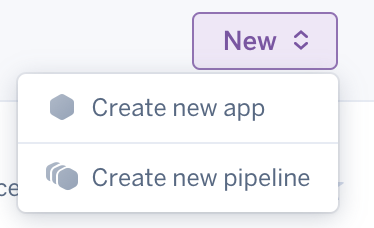
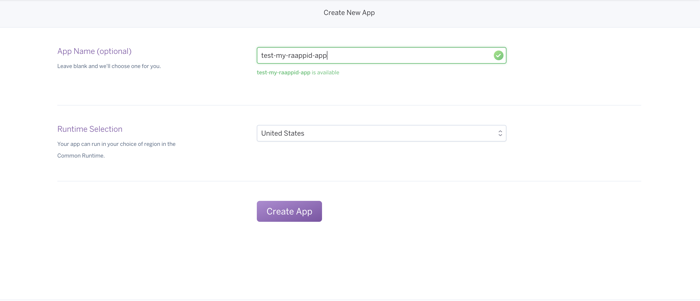

#Project deployment Guide.

#### To Deploy your Project to Heroku

1. Sign into [Heroku](https://dashboard.heroku.com/) account.
2. Click on create new button and Create new App.

3. In the following screen. Enter unique name for your app.

3. In the Deploy tab, Click on Connect to github to connect your github repository.
 
4. Follow the following documentation to Complete your Github integration with heroku. https://devcenter.heroku.com/articles/github-integration